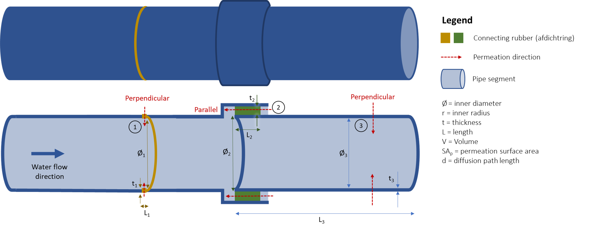
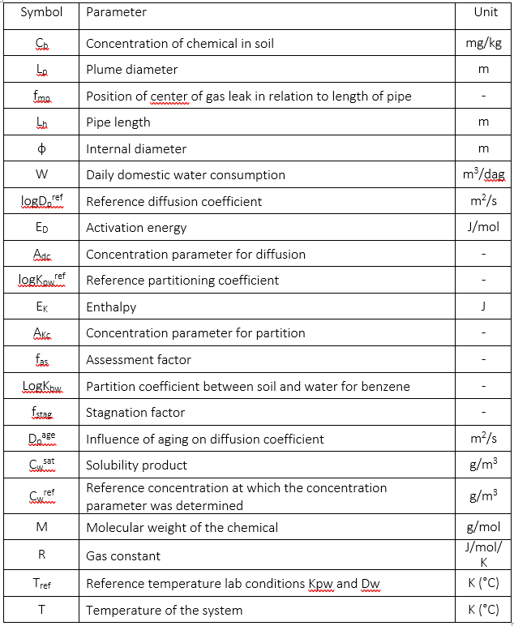

==================
Mathematical Model
==================

Conceptual Model
----------------

Permeation of an organic chemical from soil or groundwater into a pipe involves a number of steps:

#.	Transport of the chemical from the source through the soil to the pipe in question
#.	Intrusion from the soil moisture and air into the pipe
#.	Diffusion through the pipe wall
#.	Egress from the pipe wall into drinking water
#.	Diffusion and mixing in the drinking water
#.	Transport to the tapping point

For the transport of the chemical through the soil (step 1), the model assumes direct contact of contaminated soil and/or groundwater with the pipe. 
The remaining steps are calculated using the permeation model described by van der Schans et al. (2016) that underlies RIVM's risk limit values (Otte et al 2016). This model calculates the entry and exit of organic chemicals (steps 2 and 4) into the pipes based on partition coefficients (K\ :sub:`pw`) describing the concentration ratio between the pipe and groundwater. Diffusion through the pipe wall (step 3) is calculated using Fick's First Law, where the mass flux (M) is proportional to the diffusion coefficient (D\ :sub:`p`) and concentration gradient (:math:`\frac {\Delta C} {\Delta x}`) of the organic chemical in question

Model Equations
---------------
The concentration of a chemical can vary throughout the day in a drinking water pipe located in contaminated soil or groundwater. When the water in the pipe is stagnant, the concentration slowly increases due to permeation until water is used and the water in the pipe is changed with clean drinking water from the distribution system. Another "recharge cycle" then begins. The longer the recharge period, the higher the concentrations. Therefore, the highest concentrations are generally reached at the end of the night.
The model can calculate both the mean (average) concentration and the peak (concentration after a period of stagnation). The stagnation factor is only valid for a stagnation time of 8 hours. Using a different stagnation time is not advised.
This section describes the mathematical equations solved by the permeation model (see van der Schans et al 2016). The model uses SI units g/m\ :sup:`3` for concentrations in groundwater and drinking water. 

Partitioning and Diffusion coefficients
=======================================
Partitioning and diffusion coefficients (K\ :sub:`pw`, D\ :sub:`p`) are calculated using a regression model that relates these coefficients to molecular properties of the chemical contaminant, piping material, and environmental factors. The partitioning and diffusion coefficients under laboratory conditions (K\ :sub:`pw` \ :sup:`ref` , D\ :sub:`p`\ :sup:`ref`) are taken as reference to which corrections are then applied for temperature (ftemp) concentration (fconc) and age (fage) of the pipe.

.. math::
    log D_p = log D_p^{ref} + logf_{D_p}^{temp} +  logf_{D_p}^{conc} + logf_{D_p}^{age}
  :label: eq:1

.. math::
    log⁡ K_{pw} = log K_{pw}^{ref} + logf_{K_{pw}}^{temp} +  logf_{K_{pw}}^{conc} + logf_{K_{pw}}^{age}
  :label: eq:2

These corrections are calculated using the following set of equations. The meanings of the symbols are shown in XX. The influence of age is disregarded for both the partitioning and diffusion coefficients. 

.. math::
    log D_p^{ref} = -0.011 \cdot log⁡M-10.688
    :label: eq:3

.. math::
    logf_{D_p}^{temp} = \frac{E_D}{ln10 \cdot R} \cdot ( \frac{1}{T_{ref}} - \frac{1}{T}) 
    :label: eq:4
    
.. math::
    E_D = 61.857 \cdot log⁡{M}-78.919
    :label: eq:5

.. math::
    logf_{D_p}^{conc}= a_{DC} \cdot ( \frac{C_{gw}}{C_{w}^{sat}} - \frac{C_{w}^{ref}}{C_{w}^{sat}}) 
    :label: eq:6

.. math::
    logf_{D_p}^{age} = 0
    :label: eq:7

.. math::
    log K_{pw}^{ref} = 1.097 \cdot logK_{ow} - 0.689    
    :label: eq:8

.. math::
    logf_{K_{pw}}^{temp} = \frac{E_K}{ln10 \cdot R} \cdot  ( \frac{1}{T_{ref}} - \frac{1}{T}) 
    :label: eq:9

.. math::
    E_D = 7.922 \cdot log⁡{k_{ow}}-17.188
    :label: eq:10

.. math::
    logf_{K_{pw}}^{conc} = a_{KC} \cdot ( \frac{C_{gw}}{C_{w}^{sat}} - \frac{C_{w}^{ref}}{C_{w}^{sat}}) 
    :label: eq:11

.. math::
    logf_{K_{pw}}^{age} = 0
    :label: eq:12

Mean concentration
==================
The mean concentration in the drinking water pipe (:math:`C_{dw}^{Mean}` in g/m\ :sup:`3`) is calculated by dividing the mass of benzene entering the house connection (:math:`M_{segment}^{Mean}` in g) by the daily household water consumption (W, in m\ :sup:`3`)

.. math::
    C_{dw}^{Mean}=  \Sigma \frac {M_{segment}^{Mean}} {W}
    :label: eq:13

This mass flux is calculated based on the partition coefficient between the pipe and water for the given chemical (K\ :sub:`pw`, -), the diffusion coefficient of the chemical in the pipe (D\ :sub:`p`, in m\ :sup:`2`/s) the area of the pipe wall in contact with the contamination (SAp, in m\ :sup:`2`), the concentration in groundwater (Cg, in g/m\ :sup:`3`) and drinking water (CdW, in g/m\ :sup:`3`), the duration over which the concentration is determined (tmean; 24 hours) the thickness of the pipe wall and an assessment factor (fas, -). The model was originally derived for permeation of benzene from groundwater into PE. Since gas leaks and water pipes are predominantly in the unsaturated zone, a partition coefficient (Kbw) was applied to translate the measured concentration in soil (mg/kg dry soil) to a concentration in the water phase (g/m\ :sup:`3`, Eq. :eq:`15`). This coefficient is different for each substance and derived through fugicity calculations by RIVM (Meerkerk & van der Schans 2019).

.. math::
    M_{segment}^{Mean} = \frac{K_{pw} \cdot D_p \cdot SA_p (K_{bw} \cdot C_s - C_{dw}) \cdot t_{mean} } {d \cdot f_as} 
    :label: eq:14

.. math::
    K_{bw} = \frac {C_s} {C_{gw}} \cdot \frac {f_{gw}} {f_s}
    :label: eq:15

Where d is the diffusion path length. 

The above calculations are solved iteratively in the model since the concentration in drinking water (Eq. :eq:`13`) depends on the calculated mass flux (Eq. :eq:`14`). 

Permeation direction
==================
Depending on the type of pipe segment, the permeation direction can either be perpendicular (default) or parallel to the flow direction in the pipe. The diffusion path length is the length of permeation through the pipe segment. Figure 1 below illustrates three permeation options:

#.	Permeation perpendicular to flow direction through connecting segment (rubber). 
#.	Permeation parallel to flow direction through connecting segment (rubber). 
#.	Permeation perpendicular to flow direction through pipe segment. 

In the case of scenarios 1 and 3 permeation is perpendicular through pipe wall and the diffusion path length is equal to the wall thickness of the pipe. The surface area is given as the inner surface area of the segment. In *pipepermcalc* the default permeation direction is perpendicular and the diffusion path length equal to the wall thickness of the pipe length. 
The area of the pipe wall is the product of the inside diameter (∅), the contact length (Lc) and pi:

.. math::
    d=t, V_s = π \cdot (\frac{∅} {2})^2 \cdot L_c
    :label: eq:16

.. math::
    SA_p= π \cdot ∅ \cdot L_c
    :label: eq:17

In scenario 2 permeation is *parallel* to the flow direction through a connecting segment (in this case a rubber). For this scenario, the volume is assumed to be zero and the permeation surface area is the annular area of the rubber. The diffusion path length in this case is equal to the length of the segment.

.. math::
    d=L, V_s = 0
    :label: eq:18

.. math::
    SA_p= π \cdot \frac{{(∅+d)}^2 - ∅^2)} {4}
    :label: eq:19

Figure 1 Depending on the type of pipe segment, the permeation direction can either be perpendicular (default) or parallel to the flow direction in the pipe. The different scenarios for permeation are indicated on an example pipe made up of multiple segments.

Peak Concentration
==================
The stagnation concentration is calculated similarly, except that the mass flux entering the pipeline during 1 night (8 hours) is divided by total volume of the pipe along the length in contact with the contamination.

.. math::
    C_{dw}^{peak}=  \Sigma \frac {M_{segment}^{peak}} {V}
    :label: eq:20

.. math::
    V=  \Sigma V_{segment}
    :label: eq:21

When calculating the mass flux for stagnation concentrations, an 8-hour stagnation duration (tstag) is considered. The stagnation factor (fstag) is a correction for the decrease in the concentration gradient near the inner wall of the pipe during stagnation due to the increase in concentration during the night. The regression for the stagnation factor assumes a Cdw of zero.

.. math::
    M_{segment}^{peak} = \frac{K_{pw} \cdot D_p \cdot SA_p (K_{bw} \cdot C_s - 0) \cdot t_{stag} } {d \cdot f_as \cdot f_{stag}} 
    :label: eq:22

.. math::
    f_{stag} = 10^{max ( ((\frac {log D_p + 12.5} {2} + log⁡ K_{pw}) \cdot 0.73611 - 1.03574) ,0  )} 
    :label: eq:23

The above calculations are solved iteratively in the model since the concentration in drinking water (Eq. :eq:`13`) depends on the calculated mass flux (Eq. :eq:`14`). 

Model Testing
-------------
The model has been tested by calculating the concentration in drinking water given a known groundwater concentration and feeding that drinking water concentration into the model again and verifying the same groundwater concentration is output. This is done for both the peak and mean concentrations for all chemicals in the database where the molecular weight, solubility and drinking water norm were known. In addition, the drinking water norm was less than the solubility limit. See Tutorial — pipepermcalc 0.1 documentation

Symbols
-------

References
==========
van der Schans, M., Otte, P. F., Swartjes, F. A., & Meerkerk, M. (2016). Permeation of Contaminants from groundwater by polyethylene drinking water pipes KWR 2016.056. Nieuwegein, Netherlands.
Otte, F., van der Schans, M., Meerkerk, M. A., & Swartjes, F. A. (2016). Permeatie van contaminanten vanuit grondwater door polyethyleen- drinkwaterleidingen. Methodiek voor de beoordeling van risico’s voor de drinkwaterkwaliteit.