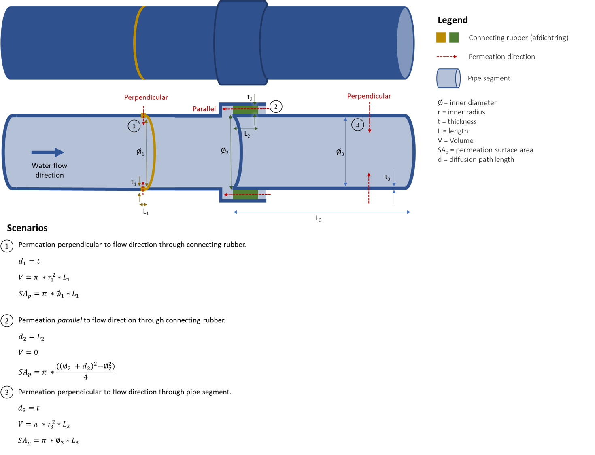

========
Tutorial
========

Steps
-----

The following steps are needed to calculate the permeation of an organic chemical to a pipe using pipepermcalc:

#. Define segment(s) of a pipe using the segment class (pipe material, size).
#. Create a pipe from the segment(s). 
#. Set the groundwater contamination conditions (chemical, groundwater concentration and temperature) and mean daily flow rate.
#. Validate the input parameters.

Once a pipe has been created and the groundwater conditions and flow rate set, two types of calculations (forward and reverse) are possible:

#. Forward - calculate the maximum or mean daily concentration in drinking water from a known groundwater or soil concentration
#. Reverse - calculate the maximum or mean daily allowable concentration in groundwater to meet a drinking water limit value for a given chemical

For the mathematical equations behind the calcualtions, see the :doc:`Mathematical Model </equations>`.

.. _forward-example:

Example 1 - Simple forward example
----------------------------------
Example forward calculation for a single pipe segment.

We always start by importing pipepermcalc Pipe and Segment classes:

.. ipython:: python

    from pipepermcalc.pipe import * 
    from pipepermcalc.segment import * 

Step 1: Define the pipe segment(s) 
==================================
For this example there is only one pipe segment made of PE40. We define the length of the pipe in contact with the contamination plume, the inner diameter and wall_thickness of the pipe in meters.

.. ipython:: python
    
    seg1 = Segment(name='seg1',
                    material='PE40',
                    length=25,
                    inner_diameter=0.0196,
                    wall_thickness=0.0027,)

Step 2: Create a pipe from the segment(s)
=========================================
We create a pipe from the segment using the Pipe() class by inputing the list of segment name(s).

.. ipython:: python

    pipe1 = Pipe(segment_list=[seg1])

Step 3: Set the groundwater conditions and flow rate
====================================================
Next we define the groundwater and pipe conditions. These are necessary if we want to calculate the concentration in drinking water for a given groundwater concentration.
We define the chemical of interest, the concentration in groundwater (g/m3), groundwater temperature (degrees Celsius) and the flow rate (m3/day).
The name of the chemical is checked against the chemical database and the closest matching chemical is printed.

.. ipython:: python
    
    pipe1.set_conditions(chemical_name="Benzeen", 
                                temperature_groundwater=12, 
                                concentration_groundwater=1.8, 
                                flow_rate=0.5)

The program gives a warning that no drinking water concentration was defined and the concentration has been set at the norm value. In the next step we will override this concentration and calculate the drinking water concentration for our defined conditions.

Step 4: Validate the input parameters
=====================================
Before we proceed with any calculations we first validate the input parameters. This step ensures we chose a valid pipe material, permeation direction and input positive values for concentrations, pipe dimensions etc.

.. ipython:: python

    pipe1.validate_input_parameters()

Step 5: Calculate the drinking water concentration
==================================================
For the given conditions we can calculate the peak and mean daily concentration in drinking water for the pipe. 
The peak concentration is calculated as the concentration after a stagnation period (e.g. at night when there is little or no flow in the pipe). The default stagnation time of 8 hours is used. 
Note: the peak is often, though not necessarily, higher than the mean concentration. Depending on the pipe dimensions and flow rate there can be situataions when the mean concentration is lower than the peak. 

.. ipython:: python
    
    peak_conc = pipe1.calculate_peak_dw_concentration()
    print("The peak concentration is:", round(peak_conc,4), "g/m3")

    mean_conc = pipe1.calculate_mean_dw_concentration()
    print("The mean daily concentration is:", round(mean_conc,4), "g/m3")  

.. _reverse-example:

Example 2 - Simple reverse example
----------------------------------
Example reverse calculation for a single pipe segment. In a reverse calculation the groundwater concentration is unknown and the drinking water concentration is set to a given value, often this value will be the drinking water limit.

The initial two steps are the same, defining the pipe segments and creating a pipe:

Step 1: Create pipe segments and define pipe
============================================

.. ipython:: python
    
    seg2 = Segment(name='seg2',
                    material='PE40',
                    length=25,
                    inner_diameter=0.0196,
                    wall_thickness=0.0027,)
    
    pipe2 = Pipe(segment_list=[seg2])

Step 2: Calculate the allowable groundwater concentration
=========================================================
The drinking water concentration is given in the set_conditions() function (*concentration_drinking_water*), or if no concentration is specified, the default is set as the drinking water norm from the internal database.
Both the groundwater concentration which would not exceed the peak and the mean daily concentration can be calculated.

.. ipython:: python

    pipe2.set_conditions(chemical_name="Benzeen", 
                            temperature_groundwater=12, 
                            flow_rate=0.5)
    
    pipe2.validate_input_parameters()

    peak_conc = pipe2.calculate_peak_allowable_gw_concentration()    
   
    print("The peak groundwater concentration, not exceeding the norm:", round(peak_conc,4), "g/m3")

    mean_conc = pipe2.calculate_mean_allowable_gw_concentration()    
   
    print("The mean groundwater concentration, not exceeding the norm:", round(mean_conc,4), "g/m3")

Miscellaneous
=============
The choice of pipe materials are: 'PE40', 'PE80', 'SBR', 'EPDM', 'PVC'. 
Note: The model assumes no permeation in PVC pipes.

The individual segment information, e.g. volume, permeation surface area, logK, LogD etc., are attributes of the segments themselves:

.. ipython:: python

    seg1.volume

    seg1.permeation_surface_area

    seg1.log_Dp

    seg1.log_Kpw

The flow rate, chemical information and the concentrations in drinking water, groundwater and/or soil are attributes of the pipe:

.. ipython:: python

    pipe1.flow_rate

    pipe1.solubility

    pipe1.concentration_drinking_water

    pipe1.concentration_groundwater

    pipe1.concentration_soil

Example 2 - Multiple segments
--------------------------------
In this example we create a pipe made from multiple segments with different permeation directions.

Depending on the types of pipe segment, the permeation direction can either be perpendicular (default) or parallel to the flow direction in the pipe. The diffusion path length is the length of permeation through the pipe segment.

In scenarios 1 and 3 above, the permeation is perpendicular to the flow direction and the volume is calculated from the segment dimensions. The surface area is given as the inner surface area of the segment. In pipepermcalc the default permeation direction is perpendicular and the diffusion path length equal to the wall_thickness of the pipe length.

In the example shown above, permeation is *parallel* to the flow direction through a connecting rubber in scenario 2. For this scenario, the volume is assumed to be zero and the permeation surface area is the annular area of the rubber. The diffusion path length in this case is equal to the length of the segment.

In the following example we create a pipe made from two 5m PE40 pipe segments, joined by a EPDM ring with permeation parallel to the flow direction:

.. ipython:: python

    seg1 = Segment(name='seg1',
                material='PE40',
                length=5,
                inner_diameter=0.0196,
                wall_thickness=0.0027)

    seg2 = Segment(name='seg2',
                    material = 'EPDM',
                    length=0.06,
                    inner_diameter=0.025,
                    wall_thickness=0.001,
                    diffusion_path_length = 0.06, 
                    permeation_direction = 'parallel')

    seg3 = Segment(name='seg3',
                material='PE40',
                length=5,
                inner_diameter=0.0196,
                wall_thickness=0.0027)

    pipe2 = Pipe(segment_list=[seg1, seg2, seg3])

As seen in the example above, only the segment with the parallel flow requires a specified permeation direction (default is perpendicular) and the diffusion path length (default is the wall_thickness).

Note: it is *not* possible to have a pipe made exclusively of segments with parallel permeation, at lease one segment must have permeation perpendicular to the flow.

The remaining calculations are done the same as for the simple example:

.. ipython:: python

    pipe2.set_conditions(chemical_name="Benzeen", 
                                temperature_groundwater=12, 
                                concentration_groundwater=1.8,
                                flow_rate=0.5)
    
    pipe2.validate_input_parameters()

    peak_conc = pipe2.calculate_peak_dw_concentration()
    print("The peak concentration is:", round(peak_conc,4), "g/m3")

    mean_conc = pipe2.calculate_mean_dw_concentration()
    print("The mean daily concentration is:", round(mean_conc,4), "g/m3")

Example 3 - Advanced settings
------------------------------------
Change the partitioning and diffusion coefficient
=================================================

The model contains a chemical database from which the partitioning (Kpw) and diffusion (Dp) coefficients for the given plastic pipes are calculated. However, it is also possible to input a specific a partitioning and diffusion coefficient for a pipe segment. This must be done *after* setting the conditions of the pipe using .set_conditions().

.. ipython:: python

    seg1 = Segment(name='seg1',
                    material='PE40',
                    length=25,
                    inner_diameter=0.0196,
                    wall_thickness=0.0027,
                    )

    pipe3 = Pipe(segment_list=[seg1])
    pipe3.set_conditions(chemical_name="Benzeen", 
                                    temperature_groundwater=12, 
                                    concentration_groundwater=1.8,)
    print(seg1.log_Kpw, seg1.log_Dp)
    
    seg1.log_Kpw = 0.912
    seg1.log_Dp= -10.63

    print(seg1.log_Kpw, seg1.log_Dp)

Change the tolerance and max_iterations
==========================================================

When calculating the concentration in drinking water or the allowable concentration in groundwater, the calculations are iterative and it is possible to specify the tolerance and maximum number of iterations. 

* The *tolerance* is the degree of acceptable error in the accuracy of the calculation, default value of 0.01 (1%). 
* The *maximum number of iterations* is the maximum number of calculations allowed before the calculation stops. A default value of 1000 is used.

These values can be manually changed in the four concentration calculations by specifying the tolerance and/or max_iterations:

.. ipython:: python

    seg1 = Segment(name='seg1',
                    material='PE40',
                    length=25,
                    inner_diameter=0.0196,
                    wall_thickness=0.0027)

    pipe4 = Pipe(segment_list=[seg1])

    pipe4.set_conditions(concentration_drinking_water=0.001,
                        chemical_name="Benzeen", 
                        temperature_groundwater=12,
                        flow_rate=0.5)
    
    pipe4.validate_input_parameters()

    mean_conc = pipe4.calculate_mean_allowable_gw_concentration(tolerance = 0.1, 
                                max_iterations=1000)

    print("The mean concentration is:", round(mean_conc,3), "g/m3")

    peak_conc = pipe4.calculate_mean_allowable_gw_concentration(tolerance = 0.001, 
                                max_iterations=1000)

    print("The peak concentration is:", round(peak_conc,3), "g/m3")

Model Testing
============= 

The model has been tested by calculating the concentration in drinking water given a known groundwater concentration and feeding that drinking water concentration into the model again and verifying the same groundwater concentration is output. This is done for both the peak and mean concentrations for all chemicals in the database where the molecular weight, solubility and drinking water norm were known. In addition, the drinking water norm was less than the solubility limit.

.. ipython:: python

    seg1 = Segment(name='seg1',
                material= 'PE40',
                length=25,
                inner_diameter=0.0196,
                wall_thickness=0.0027,
                )

    pipe1 = Pipe(segment_list=[seg1])
    input_gw = 1

    pipe1.set_conditions(
        chemical_name='Benzeen', 
                        concentration_groundwater =input_gw,
                        temperature_groundwater=12, 
                        flow_rate=0.5)

    pipe1.validate_input_parameters()

    # Peak concentration testing
    peak_conc=pipe1.calculate_peak_dw_concentration()

    print("The peak drinking water concentration is:", round(peak_conc,3), "g/m3")

    pipe1.set_conditions(chemical_name='Benzeen', 
                        temperature_groundwater=12, 
                        concentration_drinking_water = peak_conc,
                        flow_rate=0.5)

    output_gw = pipe1.calculate_peak_allowable_gw_concentration()

    print("The peak allowable groundwater concentration is:", round(output_gw,3), "g/m3")

    print("The output groundwater concentration is within ", round(abs(1-input_gw/output_gw)*100,3), "% of input groundwater concentration.")

    # Mean concentration testing
    mean_conc=pipe1.calculate_mean_dw_concentration()

    print("The mean drinking water concentration is:", round(mean_conc,5), "g/m3")

    pipe1.set_conditions(chemical_name='Benzeen', 
                        temperature_groundwater=12, 
                        concentration_drinking_water = mean_conc,
                        flow_rate=0.5)

    output_gw = pipe1.calculate_mean_allowable_gw_concentration()

    print("The mean allowable groundwater concentration is:", round(output_gw,3), "g/m3")

    print("The output groundwater concentration is within ", round(abs(1-input_gw/output_gw)*100,3), "% of input groundwater concentration.")

                            